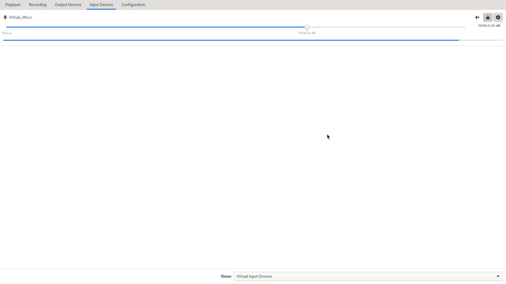

# pulseaudio-soundboard



If you ever wanted a soundboard for Linux then you are in the right place. The soundboard creates a virtual microphone that allows you to play any sound to it.

## Setup guide

For this guide I am using the i3 window manager which makes it very easy to run shell scripts with keybinds. If you're using a different desktop environment you will have to find out yourself how to bind keys to run shell scripts. This guide assumes the soundboard related files are placed in the `~/soundboard` directory.

### PREREQUISITES
- Basic understanding of Linux concepts
- The pulseaudio sound system is actually being used
- A way to bind keys to make them run shell scripts

### Step 0 - Prepare folders and scripts
```bash
mkdir ~/soundboard
#sounds folder, this is where the sounds for keys will go
mkdir ~/soundboard/sounds
#selection folder, this is where the big list of sounds is
mkdir ~/soundboard/selection

#copy over the scripts from this repo to the soundboard folder
cp -v ./scripts/* ~/soundboard
```

You also need to edit the `togglemix.sh` script, on the line where the module is loaded, change the source to your real mic input device name (step 2 shows how to find it)

### Step 1 - Initialise audio devices

You only need to do this once after pulseaudio is started (usually when you log in). Here I have it bound to `Shift+ISO_Level3_Shift` aka shift and AltGr, keep in mind however this key might not be the same on your keyboard. The command is `bash ~/soundboard/setup.sh`
> [!TIP]
> For i3, use the `xev` tool in a terminal and read the name next to keysym to find out what a keybind is called.

Add this to your i3 config:
```
bindsym Shift+ISO_Level3_Shift exec bash ~/soundboard/setup.sh
```
Then you can press the key combo and run the command `pactl list modules short` and verify if you see the audio devices at the end.

### Step 2 - Mic switcher keys
We will bind two keys which will allow you to switch between your real microphone and the virtual microphone. (More on how this works later)

Your real mic is definitely going to be named something else, run `pactl list sources short | awk '{print $2}'` for a list and replace `YOUR_REAL_MIC`

```
bindsym F9 exec "pactl set-default-source YOUR_REAL_MIC"
bindsym F10 exec "pactl set-default-source VirtualMic"
```
`F9` will set the mic to be your real mic, `F10` will use the soundboard virtual mic.

Run `pactl get-default-source` to verify that the default mic device is changing.

### Step 3 - Toggle listen key
This key allows you to listen in on what the soundboard is currently playing, toggle.
```
bindsym F11 exec bash ~/soundboard/togglelisten.sh
```

### Step 4 - Stop key
This key stops any audio from playing into the soundboard anymore.
```
bindsym Insert exec "pkill paplay"
```

### Step 5 - Key for playing a sound
The best part, a key to actually play the sound, for the format we will use `.wav` so if your sound is not `.wav` you can use ffmpeg to convert it: `ffmpeg -i thesound_file ~/soundboard/sounds/sound.wav`

```
bindsym F12 exec "paplay --device=VirtualSink ~/soundboard/sounds/sound.wav"
```

### Step 6 - Mic mixer thing
This is supposed to make it so that you can speak while a soundboard sound is playing, so both at the same time. To do that switch to soundboard mic and press the mic mixer key, it's a toggle.

```
bindsym F8 exec bash ~/soundboard/togglemix.sh
```

### Step 7 - Playing sounds from youtube
My favourite, this script asks for a search input, and goes to youtube, gets the first result and plays it through the soundboard. Remember to change the keybind

(Requires `zenity` to be installed)

```
bindsym $mod+Shift+XF86Assistant exec bash ~/soundboard/ytkey
```

### Step 8 - Play sounds locally
This works with the yt script as everything that you downloaded through it, will also appear in this menu, also you can put your own sounds in. The folder location is `~/soundboard/selection`.

This script shows you a menu with all a list of the sound files, and if you type a part of the file name it will play it. Remember to toggle listening to confirm

```
bindsym ISO_Level3_Shift exec bash ~/soundboard/choosesong.sh
```


---
## TODO
- [ ] merge `selection` and `sounds` folder


## How the mic switcher works
You need to make sure your apps to use the Default mic option, because the mic switcher changes the default microphone device.

## How the audio routing works

VirtualSink (speaker) ===loopback===> VirtualSource (speaker) ===remap===> VirtualMic (mic)

1. VirtualSink is created as a virtual speaker device
2. VirtualSource is created as another virtual speaker device
3. VirtualSource is converted to a virtual microphone with remap, becoming VirtualMic

